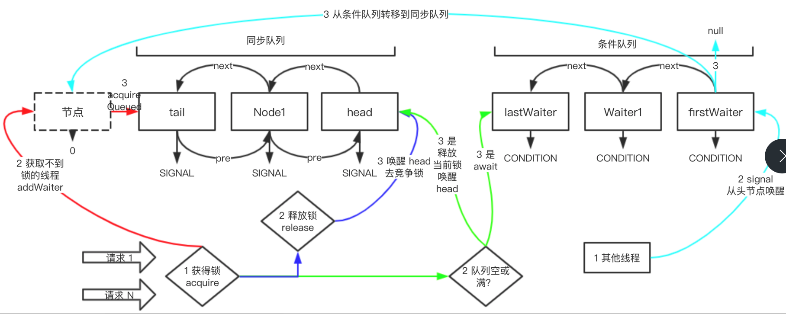

# AbstractQueuedSynchronizer源码分析

## 总体概述

AbstractQueuedSynchronizer中文翻译同步器 简称 AQS 是各个锁的的基础，比如 ReentrantLock、CountDownLatch 等等，这些我们经常用的锁底层实现都是 AQS ，所以学好 AQS 对于理解锁的实现是非常重要的。

## 整体架构



这个图总结了 AQS 整体架构的组成，和部分场景的动态流向。

1. AQS 中队列只有2个 同步队列 + 条件队列 底层数据结构两者都是链表；
2. 图中有四个颜色代表不同场景，123序号，代表着看的顺序

AQS本身是一套锁的框架，它定义了获得锁和释放锁的代码结构，所以如果新建锁 只要继承AQS，并实现相应的实现。

### 类注释

1. 提供了一种框架，自定义了先进先出的同步队列，让获取不到锁的线程能进入同步队列排队
2. 同步器有个状态值，可以根据这个状态值判断是否获取锁，此时设计及的关键在于依赖安全 atomic value 来表示状态
3. 子类可以新建非 public 的内部类，用内部类来继承 AQS 从而实现锁的功能
4. 子类可以通过给状态 CAS 赋值来决定能否拿到锁，可以定义那些状态可以获得锁， 那些状态表示取不到锁
5. AQS 提供了排他模式和共享模式，排他模式: 只有一个线程可以获得锁，共享模式:可以让多个线程获得锁，子类 ReadWriteLock 实现了两种模式
6. 内部 ConditionObject 可以被用做 Condition 我们通过 new ConditionObject() 即可得到条件队列
7. AQS 实现了锁，排队，锁队列等框架，至于如何获得锁， 释放锁的代码并没有实现，比如 tryAcquire  tryRelease、tryAcqireShared、tryReleaseShared、isHeldExclusively 这写方法
8. AQS 继承AbstractOwnableSynchronizer 是为了方便跟踪获得锁的线程，可帮助监控和诊断工具识别是那些线程持有锁
9. AQS 同步队列和条件队列， 获取不到锁的节点在入队是先进先出，但是被唤醒时，可能并不会按照先进先出的顺序执行

AQS 的类注释很多很多，以上 9 点是比较重要哦的注释总结

### 类定义

AQS 类定义

```java
public abstract class AbstractQueuedSynchronizer
    extends AbstractOwnableSynchronizer
    implements java.io.Serializable {}
```

1. AQS 是抽象类，就是给各种锁子类继承的，AQS 定义了很多如何获得锁，如何释放锁的抽象方法，目前就是为了让子类实现的

2. 继承 `AbstractOwnableSynchronizer` 就是为了监听是否获得锁，方便监控用的，

   ```java
   protected AbstractQueuedSynchronizer() { }
      /**
        * Convenience method to interrupt current thread.
        */
       static void selfInterrupt() {
           Thread.currentThread().interrupt();
       }
   ```

### 基础属性

AQS 的属性可以简单分为四类: **同步器简单属性**  **同步队列属性**  **条件队列属性** **公用Node**

#### 简单属性

首先我们来看一下简单属性有那些

```java
/**
 * The synchronization state.
 */
//AQS 状态 子类会根据这个状态进行判断是否可以获得锁
private volatile int state;
  // Queuing utilities

    /**
     * The number of nanoseconds for which it is faster to spin
     * rather than to use timed park. A rough estimate suffices
     * to improve responsiveness with very short timeouts.
     */
		//自旋超时阈值 单位纳秒
    static final long spinForTimeoutThreshold = 1000L;
```

重要的就是 state 属性，是 int类型，所有继承这个抽象类都是通过这个字段判断能不能获得锁，

能不能释放锁。

#### 同步队列属性

当多个线程来请求锁时，某一个时刻有且只有一个线程能获得锁 那么剩余获取不到锁的线程，都会到同步队列中去排队阻塞自己，当有线程主动释放锁时，就会从同步队列头开始释放一个排队的线程，让线程重新去竞争锁。

所以同步队列的主要作用阻塞获取不到锁的线程，并且在适当时间释放这些线程

同步队列底层是双向链表，我们从源码中可以看到链表的头尾

```java
/**
 * Head of the wait queue, lazily initialized.  Except for
 * initialization, it is modified only via method setHead.  Note:
 * If head exists, its waitStatus is guaranteed not to be
 * CANCELLED.
 */
//同步队列的头
private transient volatile Node head;

/**
 * Tail of the wait queue, lazily initialized.  Modified only via
 * method enq to add new wait node.
 */
//同步队列的尾部
private transient volatile Node tail;
```

#### 条件队列的属性

条件队列和同步队列功能一样，管理获取不到锁的线程， 底层数据结构也是链表队列，但是条件不直接和锁打交道，但是常常和锁配合使用

```java
public class ConditionObject implements Condition, java.io.Serializable {
    private static final long serialVersionUID = 1173984872572414699L;
    /** First node of condition queue. */
    private transient Node firstWaiter;
    /** Last node of condition queue. */
    private transient Node lastWaiter;
```

这就是所谓的条件队列 需要时直接使用，new ConditionObject() 即可。

`ConditionObject` 是实(现 `Condition` 接口， `Condition` 接口相当于 `Object` 的各种监控方法。比如 `Object#wait()`、 `Object#notify` 、`Object#notifyAll` 

#### Node

Node  非常重要，即时同步队列的节点，又是条件队列节点，在入队的时候，我们 Node 把线程包装一下，然后把 Node 放入两个队列中，我们看一下 Node 的数据结构

```java
static final class Node {
    /** Marker to indicate a node is waiting in shared mode */
    static final Node SHARED = new Node();
    /** Marker to indicate a node is waiting in exclusive mode */
    static final Node EXCLUSIVE = null;

    /** waitStatus value to indicate thread has cancelled */
    static final int CANCELLED =  1;
    /** waitStatus value to indicate successor's thread needs unparking */
    static final int SIGNAL    = -1;
    /** waitStatus value to indicate thread is waiting on condition */
    static final int CONDITION = -2;
    /**
     * waitStatus value to indicate the next acquireShared should
     * unconditionally propagate
     */
    static final int PROPAGATE = -3;

    volatile int waitStatus;

    
    volatile Node prev;

  
    volatile Node next;

   
    volatile Thread thread;

   
    Node nextWaiter;

   
    final boolean isShared() {
        return nextWaiter == SHARED;
    }

   
    final Node predecessor() throws NullPointerException {
        Node p = prev;
        if (p == null)
            throw new NullPointerException();
        else
            return p;
    }

    Node() {    // Used to establish initial head or SHARED marker
    }

    Node(Thread thread, Node mode) {     // Used by addWaiter
        this.nextWaiter = mode;
        this.thread = thread;
    }

    Node(Thread thread, int waitStatus) { // Used by Condition
        this.waitStatus = waitStatus;
        this.thread = thread;
    }
}
```